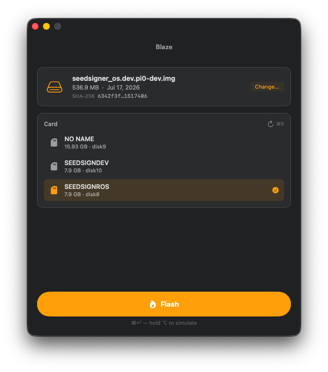
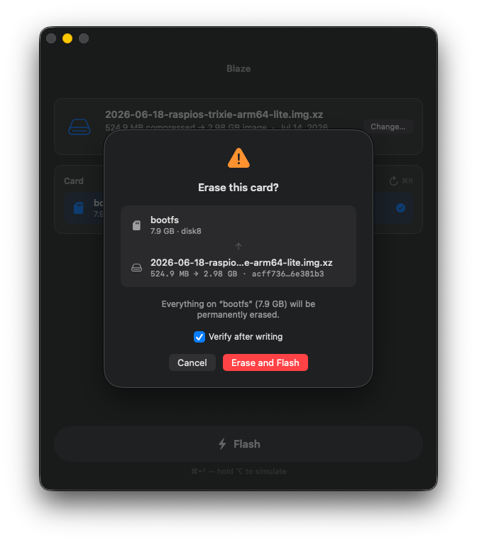
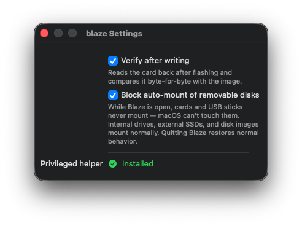

# Blaze

A native macOS app for flashing disk images to SD and microSD cards. Pick an image, pick a card, press Flash.

<p align="center">
  
</p>

Blaze is a single-purpose system tool built entirely on Apple frameworks — SwiftUI, DiskArbitration, ServiceManagement, Security, Compression, CryptoKit — with zero third-party dependencies. Writing raw bytes to a disk device requires root, so Blaze installs a privileged helper once through `SMAppService` (a single admin prompt), and needs Full Disk Access granted once in System Settings. After that one-time setup, every flash — across relaunches and reboots — runs without prompting.

## Features

- **Raw and compressed images** — flashes `.img` directly, and streams `.img.xz` and `.img.gz` through Apple's Compression framework while writing, no temporary decompressed file. The exact image size is read from the xz index (or the gzip trailer) in milliseconds, shown as *"525 MB compressed → 2.98 GB image"*.
- **Verify after write** (on by default) — reads the card back and compares it byte-for-byte against the image, reporting the exact byte offset of the first mismatch. Compressed images are re-decoded for the comparison.
- **SHA-256 of the image** — computed in the background and shown compacted (`4518dba…863e907`); click to copy the full digest for checking against a publisher's checksum.
- **Smart card picker** — works with both **USB card readers** and the **built-in SD slot** on MacBook Air/Pro (whose cards report as internal-bus but are correctly recognized). Disks are score-ranked by how likely they are to be an SD card (removability, size, bus, media name), the best candidate is preselected, and fixed drives — the boot disk and external NVMe/SSD/HDD enclosures — never appear at all. The list updates live on insert/remove via DiskArbitration — no polling, no rescan button mashing (though ⌘R exists).
- **Mount blocking** — while a flash runs, the helper dissents every mount of the target disk, so macOS can't auto-mount a half-written filesystem and scribble Spotlight/fseventsd metadata over it (a real corruption mode this feature was born from). Optionally (Settings, on by default) Blaze blocks auto-mounting of *all* removable media while the app is open; disk images and fixed external drives are unaffected, and normal behavior returns on quit.
- **Defense in depth** — the root helper re-derives every fact about the target itself and refuses to write anything that is not an external, non-boot whole disk that the image fits on. It validates its XPC peer's code signature (team + bundle ID), and the app pins the helper's identity in return. A UI bug cannot overwrite your boot drive.
- **Won't-fit handling** — a too-large image disables Flash up front with both sizes named; when the size is unknowable (gzip images over 4 GB), the helper stops cleanly at the device boundary instead.
- **Progress you can trust** — determinate bar with real MB/s and ETA through Unmounting → Writing → Syncing → Verifying → Ejecting; indeterminate with a live byte counter when the total genuinely isn't known.
- **Silent helper updates** — the daemon exits when idle, so launchd always spawns the binary shipped inside the current app bundle; updating Blaze never re-prompts.
- **Simulate mode** — hold ⌥ and the Flash button becomes *Simulate (no write)*: the full pipeline runs (safety gates, decode, progress, verify-read) against `/dev/null` with the card untouched.
- **Native throughout** — keyboard-first (⌘O open, ⌘R rescan, ⌘↩ flash, ⎋ cancel), drag-and-drop, destructive confirmation sheet that names exactly what will be erased, light/dark, remembers the last image and card across launches.

## Screenshots

| Confirmation before an unrecoverable write | Settings |
|:---:|:---:|
|  |  |

## Building

Requirements: macOS 26, Xcode 26, and an Apple Development signing identity.

1. Clone and open:

   ```sh
   git clone <repo-url> blaze && cd blaze
   open blaze.xcodeproj
   ```

2. **Set your signing team** on both targets (`blaze` and `BlazeHelper`). If your team or bundle IDs differ from `CNXH3K5L72` / `dev.derivation48.blaze(.helper)`, the identity is pinned in more places than build settings — see *Changing the app identity* below. These pins are the privilege boundary; don't remove them.

3. Build and run (⌘R in Xcode, or):

   ```sh
   xcodebuild -scheme blaze -configuration Debug build
   ```

   The build produces `blaze.app` with the helper embedded in `Contents/MacOS/` and its launchd plist in `Contents/Library/LaunchDaemons/`.

4. **First launch — onboarding, three steps:**
   - **Install the helper** — one admin password prompt, never again.
   - **Grant Full Disk Access** — onboarding deep-links you to System Settings → Privacy & Security → Full Disk Access; turn on **Blaze** and (if macOS offers) let it quit and reopen. This is the permission that lets the root helper reach the raw disk device — macOS TCC gates those even for root, and Blaze can only detect and link to this setting, since there is no API to prompt for it.
   - **Learn ⌘O / ⌘↩.**

5. **Flashing** — with the helper installed and Full Disk Access granted, flashing is prompt-free. If FDA is missing or later revoked, pressing Flash shows a sheet that explains it and deep-links to the right Settings pane; Simulate (⌥) needs no permissions since it writes to `/dev/null`. FDA status is also shown in Settings.

### Changing the app identity

The team ID and bundle IDs are load-bearing in five places that must move together — changing only the build settings leaves the app↔helper trust broken (each side rejects the other's signature):

1. **Build settings** — `DEVELOPMENT_TEAM` and `PRODUCT_BUNDLE_IDENTIFIER` on both targets, plus the helper's `PRODUCT_NAME` and `OTHER_CODE_SIGN_FLAGS -i …` (the helper binary is named after its bundle ID).
2. **Code-signing pins** — the requirement strings in `BlazeHelper/PeerValidator.swift` (helper validates the app) and `blaze/Service/HelperManager.swift` (app validates the helper) embed both the bundle ID and the team ID.
3. **Mach service constant** — `blazeHelperMachServiceName` in `Shared/BlazeHelperProtocol.swift`.
4. **The launchd plist** — `BlazeHelper/<bundle-id>.plist`: its filename, `Label`, `MachServices` key, `BundleProgram` path, and `AssociatedBundleIdentifiers` (which is what lets the helper share the app's TCC grant).
5. **`SMAppService.daemon(plistName:)`** in `HelperManager.swift` must match the plist filename.

After an identity change, the first launch behaves like a fresh install: onboarding returns (new `UserDefaults` domain), the helper asks for its one admin approval under the new label, and Full Disk Access must be re-granted (TCC keys the grant to the bundle ID, so the new identity needs its own). The old identity's daemon lingers as a stale entry under System Settings → General → Login Items & Extensions — remove it there, or `sudo launchctl bootout system/<old-label>`.

### Releasing

Once the app is notarized (Xcode Organizer → Distribute → Direct Distribution, or `notarytool submit`) and exported, `scripts/make-release.sh` packages it and publishes a GitHub release:

```sh
scripts/make-release.sh 1.1.2 path/to/exported/Blaze.app
```

It verifies the signature, staples the notarization ticket if needed, confirms Gatekeeper accepts it (`source=Notarized Developer ID`), builds `dist/Blaze-<version>.dmg` (with a drag-to-Applications affordance, and the DMG itself stapled), prints the SHA-256, then tags `v<version>`, pushes the tag, and creates the release with the DMG attached and the checksum in the notes. If you omit the app path it looks in `./dist/Blaze.app` then the latest Xcode archive. Requires an authenticated `gh`. It will not submit for notarization or release an app Gatekeeper rejects.

### Development notes

- The helper binary supports a standalone gate check: `dev.derivation48.blaze.helper --validate diskN` prints `ALLOW`/`REFUSE` with the reason, without XPC or a UI.
- The safest way to exercise the real write/verify path is a disk image: `hdiutil create -size 100m -layout NONE -o scratch -type UDIF && hdiutil attach -nomount scratch.dmg` yields a user-owned `/dev/rdiskN` the full pipeline can run against.
- Helper changes deploy on the next launch after the daemon idle-exits (~15 s after the app quits). Protocol changes must bump `blazeHelperVersion` in `Shared/BlazeHelperProtocol.swift`, which triggers an automatic re-registration.
- App and helper log to the `dev.derivation48.blaze` / `dev.derivation48.blaze.helper` subsystems: `log stream --level info --predicate 'subsystem BEGINSWITH "dev.derivation48.blaze"'` shows disk scoring, selection, helper lifecycle, and flash phase/failure detail.

## License

Blaze is released under the [MIT License](LICENSE).
